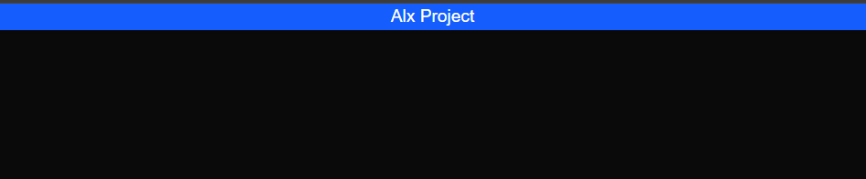

Next.js Project Setup and Basics.

# ALX Project 2 – Next.js Setup

This project was scaffolded using **Next.js** with **TypeScript**, **ESLint**, and **Tailwind CSS**.

## Features Implemented
- Scaffolded project with `npx create-next-app@latest alx-project-2`
- Enabled TypeScript, ESLint, and Tailwind CSS during setup
- Created folder structure:
  - `components/layout/Header.tsx` → Reusable header component
  - `interfaces/index.ts` → TypeScript interfaces
  - `public/assets/images/` → Static assets folder
- Header Component:
  - Accepts `title` and optional `links` props
  - Displays navigation links using Next.js `<Link>`
  - Styled with Tailwind CSS (`bg-blue-600`, `text-center`, etc.)
- Homepage (`pages/index.tsx`):
  - Displays a welcome message styled with Tailwind
  - Integrates the `Header` component

## Running the Application
Start the development server on port **3000**:

```bash
npm run dev -- -p 3000

## Preview

Here’s what the homepage looks like:




